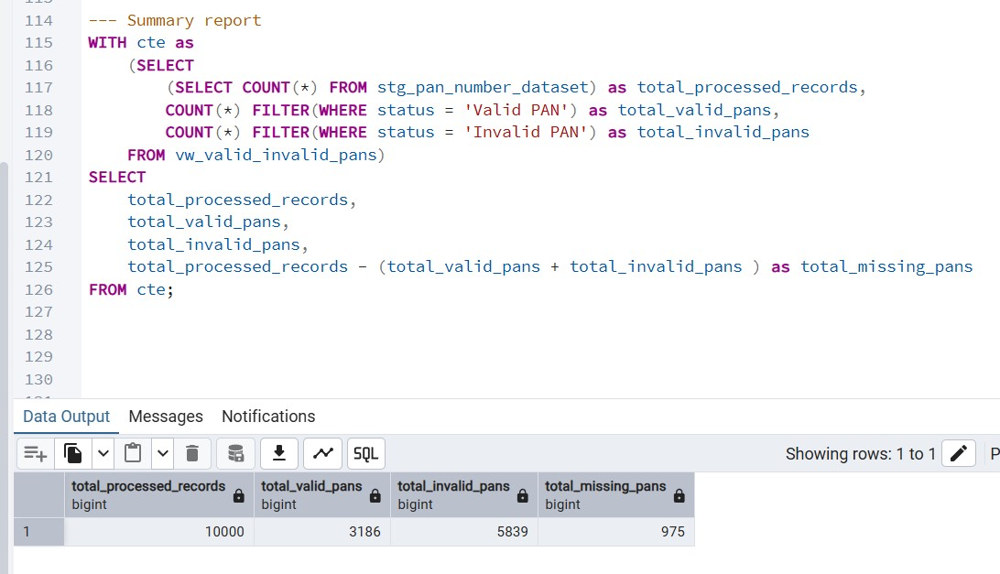
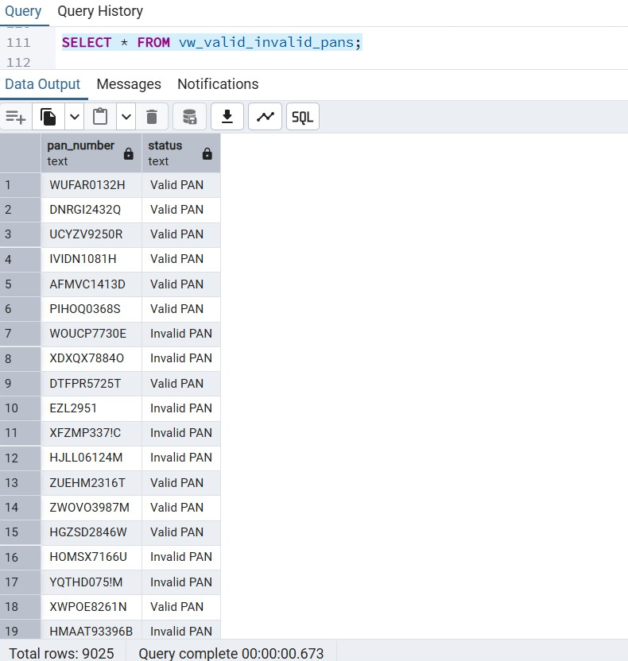

# 🔐 PAN Number Validation & Data Cleaning 
### SQL + Python Dual Implementation


A comprehensive data validation project that implements PAN (Permanent Account Number) validation using **both SQL and Python**, demonstrating proficiency in multiple data processing approaches with the same dataset.

## 🎯 What This Project Does

This dual-implementation project validates Indian PAN numbers using two different approaches:
- **PostgreSQL**: Advanced SQL with custom functions and complex validation logic
- **Python**: Pandas-based data processing with regex validation and automated reporting

Both implementations process the same dataset and deliver identical validation results, showcasing versatility in data processing techniques.

## 📋 About PAN Numbers

**PAN Format**: AAAAA1234A (10 characters)
- **First 5**: Alphabetic characters (A-Z)
- **Next 4**: Numeric digits (0-9) 
- **Last 1**: Alphabetic character (A-Z)

**Special Validation Rules**:
- ❌ No adjacent identical characters (AABCD ❌, AXBCD ✅)
- ❌ No sequential patterns (ABCDE ❌, ABCDX ✅)  
- ❌ No sequential digits (1234 ❌, 1923 ✅)
- ✅ Must match exact format and length requirements

## 🛠️ Implementation Approaches

### 🐘 SQL Implementation (PostgreSQL)
**Advanced Features Used:**
- Custom PL/pgSQL functions for validation logic
- Complex CTEs for multi-step data processing  
- Regular expressions for pattern matching
- Window functions for data analysis
- Views for reusable data structures

### 🐍 Python Implementation (Pandas)
**Core Libraries & Techniques:**
- **Pandas**: Data manipulation and cleaning
- **Regular Expressions**: Pattern validation
- **Custom Functions**: Modular validation logic  
- **Excel Integration**: Multi-sheet output generation
- **Data Export**: Automated report generation

## 🧹 Data Cleaning Process (Both Implementations)

### Step 1: Handle Missing Data
- **SQL**: `WHERE pan_number IS NOT NULL AND TRIM(pan_number) <> ''`
- **Python**: `df.replace({'Pan_Numbers': ''}, pd.NA).dropna()`

### Step 2: Remove Duplicates  
- **SQL**: `SELECT DISTINCT` with GROUP BY analysis
- **Python**: `df.drop_duplicates(subset="Pan_Numbers", keep='first')`

### Step 3: Standardize Format
- **SQL**: `UPPER(TRIM(pan_number))`
- **Python**: `df["Pan_Numbers"].str.strip().str.upper()`

### Step 4: Advanced Validation
- **SQL**: Custom functions + regex pattern matching
- **Python**: Lambda functions + regex validation

## 📊 Key Results

### 📋 Data Processing Summary


### ✅ Valid vs Invalid PAN Distribution  


### 🔄 SQL vs Python Performance Comparison
Both implementations process 10,000+ records with identical accuracy:
- **SQL**: Leverages database optimization for large datasets
- **Python**: Provides flexible data manipulation and export options

## 🗃️ Technical Architecture

### SQL Database Structure
```

stg_pan_number_dataset
├── pan_number (text) -- Raw PAN data

vw_valid_invalid_pans
├── pan_number (text) -- Cleaned PAN
└── status (text)     -- Valid/Invalid classification

```

### Python Data Pipeline
```


# Core validation functions

has_adjacent_repetition(pan) → boolean
is_sequential(pan) → boolean
is_valid_pan(pan) → boolean

# Data processing flow

Raw Data → Cleaning → Validation → Report Generation

```

## 💻 Skills Demonstrated

### SQL Expertise
- **Custom Functions**: PostgreSQL PL/pgSQL development
- **Advanced Queries**: CTEs, window functions, complex joins
- **Data Validation**: Regex patterns, business rule implementation
- **Performance**: Optimized queries for large datasets

### Python Proficiency  
- **Data Manipulation**: Pandas for ETL operations
- **Function Development**: Modular, reusable validation logic
- **File Handling**: Excel read/write operations with multiple sheets
- **String Processing**: Advanced regex and text manipulation

## 📁 Project Files

```

📦 pan-validation-sql-python
├── 📄 README.md                                    (This file)
├── 📄 PAN_card_validation.sql                      (Complete SQL implementation)
├── 📄 pan_validation.py                            (Complete Python implementation)
├── 📄 PAN Number Validation Dataset.xlsx           (Original dataset)
├── 📄 PAN Number Validation Dataset.csv            (CSV format for SQL import)
├── 📄 PAN VALIDATION RESULT.xlsx                   (Python output with validation results)
├── 📄 PAN Number Validation - Problem Statement.pdf (Project requirements)
├── 📷 summary_report.jpg                           (Summary analysis results)
└── 📷 validation_categories.jpg                    (Valid/Invalid categorization)

```

## 🚀 How to Run This Project

### Option 1: SQL Implementation
**Prerequisites:** PostgreSQL, pgAdmin
1. Import CSV dataset into `stg_pan_number_dataset` table
2. Execute `PAN_card_validation.sql` script  
3. Query `vw_valid_invalid_pans` view for results

### Option 2: Python Implementation  
**Prerequisites:** Python 3.7+, pandas, openpyxl
```

pip install pandas openpyxl
python pan_validation.py

```
**Output:** `PAN VALIDATION RESULT.xlsx` with validation results and summary

## 🔍 Validation Logic Comparison

| Feature | SQL Implementation | Python Implementation |
|---------|-------------------|----------------------|
| **Adjacent Check** | Custom PL/pgSQL function | Python loop with string indexing |
| **Sequence Check** | ASCII comparison in function | ord() function comparison |
| **Pattern Match** | PostgreSQL regex `~` | Python `re.match()` |
| **Performance** | Database-optimized | Memory-efficient pandas |
| **Output Format** | Database view | Excel with multiple sheets |

## 💡 What I Learned

- **Database Programming**: Advanced PostgreSQL function development
- **Python Data Science**: Pandas for real-world data processing  
- **Comparative Analysis**: SQL vs Python for same business problem
- **Data Quality**: Comprehensive validation rule implementation
- **Documentation**: Creating clear technical specifications

## 🎓 Business Value

This project demonstrates ability to:
- ✅ **Multi-Technology Expertise**: Solve same problem using different tools
- ✅ **Data Quality Assurance**: Implement complex validation rules  
- ✅ **Financial Compliance**: Handle sensitive government ID validation
- ✅ **Scalable Solutions**: Process thousands of records efficiently
- ✅ **Report Generation**: Create business-ready summary reports
- ✅ **Code Documentation**: Write maintainable, reusable functions

## 🔄 Why Both SQL and Python?

**SQL Advantages:**
- Database integration and optimization
- Set-based operations for large datasets
- Enterprise data warehouse compatibility

**Python Advantages:**  
- Flexible data manipulation and analysis
- Rich ecosystem of data science libraries
- Easy report generation and file export

*This project demonstrates my ability to use both SQL and Python for data validation, supporting data engineering and analytics tasks.*

## ✉️ Contact

**Sankaran S**  
[](https://github.com/sankaran-s2001) [](https://www.linkedin.com/in/sankaran-s21/) [](mailto:sankaran121101@gmail.com)

---
